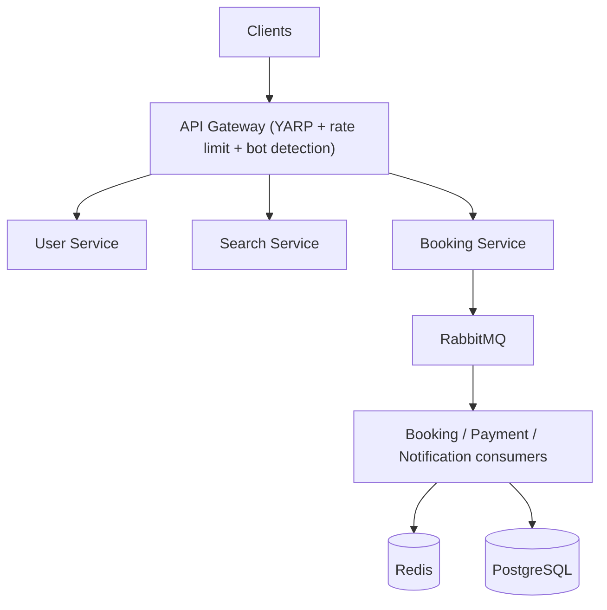

# Tatkal Booking System

A high-concurrency railway/Tatkal ticket booking platform, built to
demonstrate real distributed-systems engineering — not a CRUD app with
extra services bolted on.

It exists to answer questions like: what happens when 10,000 users try to
book the same train at once? How do we guarantee two of them never get the
same seat? What happens when Redis, RabbitMQ, or the payment provider goes
down mid-booking? See `docs/interview-prep/` for the full Q&A this project
is built to support, and `docs/architecture/` for how it all fits together.

## ⚠️ How this repo was built — read this first

All 20 phases are implemented as real, structured C# — entities, DbContexts,
controllers, consumers, the three seat-locking strategies, the saga,
outbox, idempotency, rate limiting, bot detection, event sourcing,
SignalR, and OpenTelemetry wiring all exist as actual code, not stubs.

**However:** this was authored in a sandbox with no .NET SDK and no Docker
available, so **none of it has been compiled, run, or tested here.** Treat
this as a thorough, reviewed-by-hand reference implementation, not
verified-passing code. Before relying on it:

```bash
dotnet restore
dotnet build
dotnet test tests/UnitTests   # runs offline, no external deps
```

The Docker Compose bootstrap now creates the four service databases and applies
the hand-authored SQL schemas automatically on first initialization of the
Postgres volume. If you already have an old volume, recreate it with:

```bash
docker compose down -v
docker compose up --build
```

`tests/UnitTests` can run without external infrastructure. `tests/ConcurrencyTests`
and the integration tests that use Testcontainers require Docker.

## Status: 20 implementation phases completed in source; runtime verification pending

- [x] Phase 1 — architecture & repository structure
- [x] Phase 2 — database entities, DbContexts, hand-authored SQL migrations
- [x] Phase 3 — User Service (JWT auth) & Search Service (cache-aside)
- [x] Phase 4 — Booking Service core (state machine, controller, queue hand-off)
- [x] Phase 5 — seat concurrency: 3 strategies behind `ISeatLockStrategy` (ADR-004)
- [x] Phase 6 — Redis: L1/L2 cache-aside, rate-limit counters, distributed lock
- [x] Phase 7 — RabbitMQ/MassTransit: retry, prefetch, DLQ conventions
- [x] Phase 8 — payment saga (simulated gateway, realistic outcome distribution)
- [x] Phase 9 — transactional outbox + background publisher
- [x] Phase 10 — idempotency (`Idempotency-Key` + request-hash conflict detection)
- [x] Phase 11 — rate limiting (3 strategies) + bot risk scoring + CAPTCHA simulation
- [x] Phase 12 — booking expiration sweeper (persisted, restart-safe)
- [x] Phase 13 — event sourcing (append-only `BookingEvents`, read endpoint)
- [x] Phase 14 — SignalR real-time booking status
- [x] Phase 15 — OpenTelemetry tracing + Prometheus metrics, wired into every service
- [x] Phase 16 — k6 load tests (Tests A-E) + RabbitMQ dead-letter admin API
- [x] Phase 17 — concurrency test (Testcontainers) + integration tests
- [x] Phase 18 — optimization notes (see bottleneck doc — no fabricated numbers)
- [x] Phase 19 — full documentation (this file + `docs/`)
- [x] Phase 20 — Docker Compose with health checks for every service

## Architecture



Full diagrams live in [`docs/architecture/README.md`](docs/architecture/README.md).
For the end-to-end walkthrough of how every piece connects, see
[`docs/architecture/project-flow.md`](docs/architecture/project-flow.md)
(system view) and
[`docs/architecture/functional-flow.md`](docs/architecture/functional-flow.md)
(user journey, happy + unhappy paths).

## Technology stack

C#, ASP.NET Core, .NET 8, EF Core, PostgreSQL, Redis, RabbitMQ +
MassTransit, YARP, OpenTelemetry + Prometheus + Grafana + Jaeger, Serilog,
xUnit + FluentAssertions + Testcontainers, k6, Docker Compose.

## Local setup

```bash
cp .env.example .env      # fill in real values
docker compose up --build
psql -h localhost -U tatkal -d tatkal_search -f infrastructure/seed/seed.sql
```

| Service | URL |
|---|---|
| API Gateway | http://localhost:8080 |
| RabbitMQ management | http://localhost:15672 |
| Prometheus | http://localhost:9090 |
| Grafana | http://localhost:3000 |
| Jaeger UI | http://localhost:16686 |

## Concurrency strategy

Three approaches to "500 users, one seat," all behind the same
`ISeatLockStrategy` interface, switchable via `SeatLocking:Strategy` in
config with no code change:

| Strategy | File | Idea |
|---|---|---|
| `Optimistic` | `OptimisticConcurrencySeatLockStrategy.cs` | Just insert; let the unique index reject losers |
| `DbTransaction` | `DbTransactionSeatLockStrategy.cs` | PostgreSQL transaction advisory lock + unique-index fallback |
| `RedisAssisted` (default) | `RedisAssistedSeatLockStrategy.cs` | Redis lock as admission filter in front of `Optimistic` |

Postgres's partial unique index on `SeatReservations` is the actual
correctness guarantee in every case — see
[ADR-004](docs/adr/ADR-004-db-locking-vs-redis-locking.md), proven by
`tests/ConcurrencyTests/SeatContentionTests.cs` and load test D.

## Repository structure

```text
tatkal-booking-system/
├── src/
│   ├── ApiGateway/              YARP + rate limiting + bot detection + CAPTCHA sim
│   ├── Services/
│   │   ├── UserService/         JWT auth, registration, profiles
│   │   ├── SearchService/       Cache-aside train/schedule search
│   │   ├── BookingService/      Core: state machine, seat locking, saga, outbox, SignalR, event sourcing
│   │   ├── PaymentService/      Simulated payment gateway
│   │   └── NotificationService/ Simulated notification delivery
│   └── BuildingBlocks/          Observability, Messaging, Resilience, Authentication, Contracts
├── tests/                       Unit (state machine), Concurrency (Testcontainers), Integration, E2E
├── load-tests/                  k6 scripts for Tests A-E
├── infrastructure/               docker, prometheus, grafana, seed data
├── docs/
│   ├── architecture/            System diagrams, project-flow, functional-flow
│   ├── adr/                     ADR-001 through ADR-010
│   ├── database/                Schema notes
│   ├── failure-scenarios/       The 10 scenarios and their mechanisms
│   ├── benchmarks/               Empty until real k6 runs happen (no fabricated numbers)
│   └── interview-prep/          System design Q&A, bottleneck Q&A, brainstorming prompts
├── docker-compose.yml
└── README.md
```

## Failure handling

All ten scenarios from spec section 22, and exactly which mechanism
handles each, are in
[`docs/failure-scenarios/README.md`](docs/failure-scenarios/README.md).

## Architecture decisions

Ten ADRs in [`docs/adr/`](docs/adr/) covering microservices vs. monolith,
RabbitMQ, Redis, the concurrency strategy comparison, the saga, the
outbox, event-sourcing scope, PostgreSQL, YARP, and SignalR.

## Interview prep

[`docs/interview-prep/`](docs/interview-prep/) has three files written
specifically to prep for a system-design interview built around this
project: system design Q&A with pointers into the code, honest bottleneck
Q&A (including what's NOT solved yet), and open-ended brainstorming
prompts for extending the design further.

## Known limitations

- **Not compiled/run in this environment** — see the warning at the top.
- SignalR has no Redis backplane yet — status pushes only reach clients
  connected to the SAME Booking Service instance that produced the event;
  breaks once Booking Service scales beyond 1 replica (ADR-010).
- Payment Service still publishes `PaymentSucceeded` / `PaymentFailed` directly from its consumer/controller; it does not yet have its own transactional outbox. Notification Service also publishes directly. This is an explicit remaining reliability requirement before calling the system fully production-grade.
- Database schemas are currently maintained as hand-authored SQL in
  `Migrations/001_init.sql` per service. EF Core model configuration uses PostgreSQL `xmin` row-versioning for Booking/SeatReservation concurrency; no `dotnet ef` migration history is currently committed.
- No automated Idempotency/Outbox/Inbox retention and cleanup jobs yet (see brainstorming question #10).
- `DeadLetterAdminController`'s retry endpoint re-publishes a raw message
  body rather than reconstructing the full MassTransit envelope — a
  documented simplification, not production-ready as-is.
- No benchmark numbers yet — `docs/benchmarks/` stays empty until real k6/NBomber runs happen, per the rule against fabricating results.

## Requirements and implementation status

The current implementation requirements and remaining gaps are tracked in
[`docs/requirements.md`](docs/requirements.md). This document is the source
of truth for what is implemented, what still needs runtime verification, and
what remains before the project can be described as production-grade.

## Future improvements

Tracked inline as `// TODO` comments at the relevant call sites, plus the
open questions in `docs/interview-prep/brainstorming-questions.md`.

## License

MIT — see [LICENSE](LICENSE).
