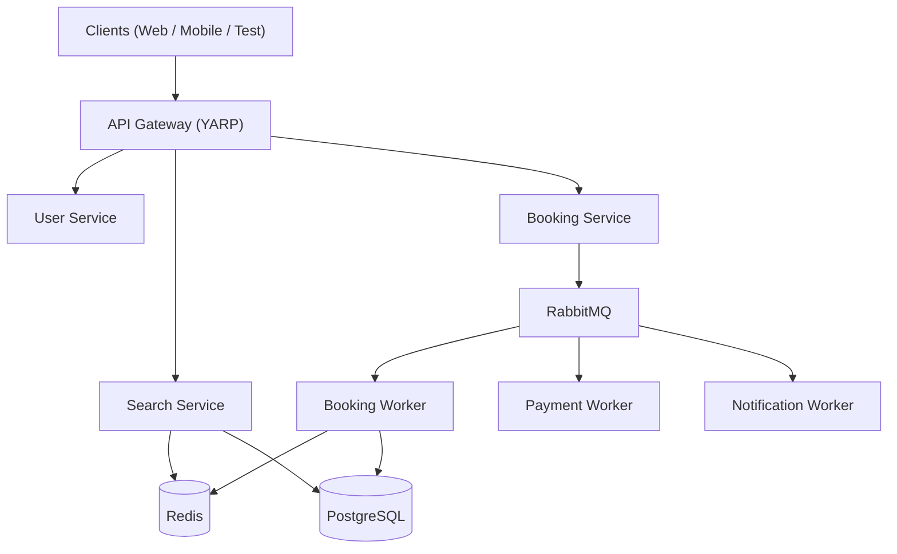
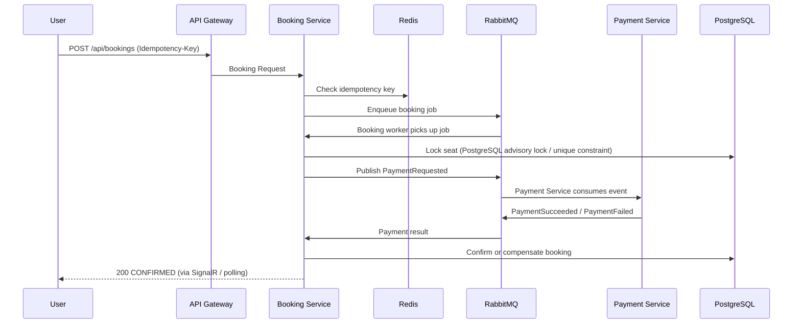
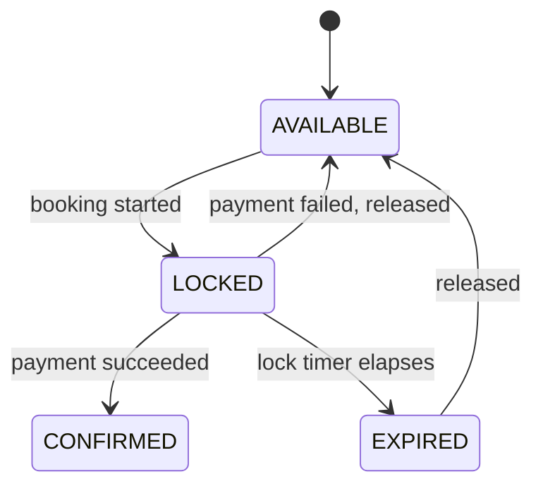
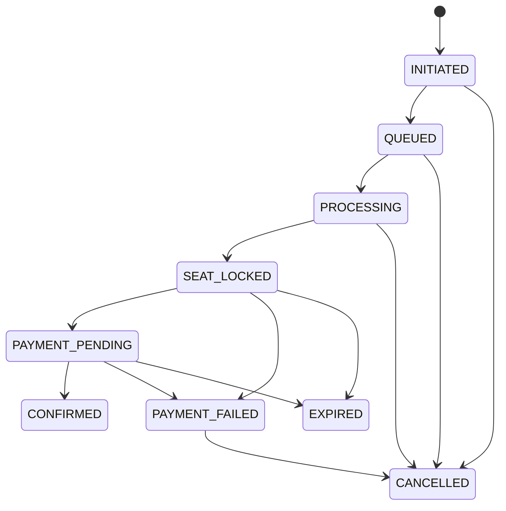
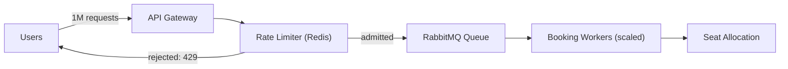
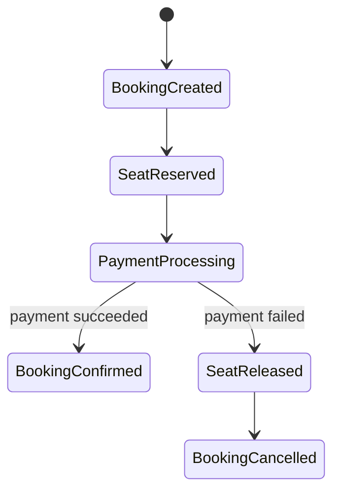
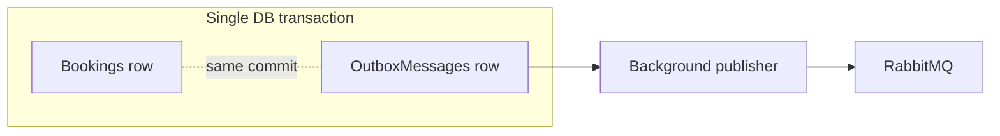
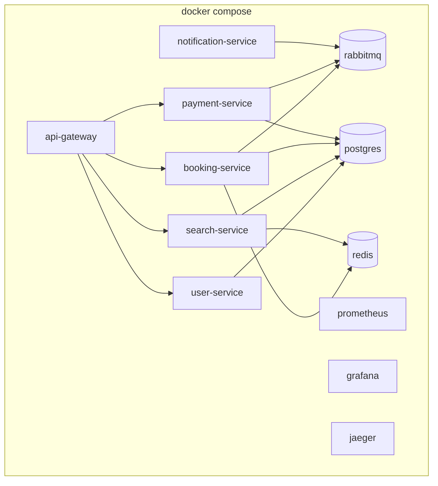

# Architecture Overview

## System diagram

## Booking sequence (happy path)

## Seat locking lifecycle

## Booking state machine

Implemented as an explicit lookup table in
[`BookingStateMachine`](../../src/Services/BookingService/StateMachine/BookingStateMachine.cs) —
see the tests in `tests/UnitTests/BookingStateMachineTests.cs`.

## Tatkal queue under load

The queue exists specifically so that a Tatkal-opening spike does not send
every booking request directly into seat-allocation database work. Booking
creation is asynchronous; actual seat allocation occurs in the Booking Service
consumer. See ADR-002 and ADR-006.

## Payment saga

## Outbox pattern

Guarantees the booking write and the "I intend to publish this event"
write commit atomically — see ADR-006.

## Deployment topology

## Phase plan

The source implementation now covers all 20 planned phases. The checkboxes
below describe implementation status, not successful runtime verification.
Runtime verification requires the .NET SDK and Docker.

- [x] **Phase 1** — architecture & repository structure
- [x] **Phase 2** — database entities, DbContexts, hand-authored SQL schemas
- [x] **Phase 3** — User & Search services
- [x] **Phase 4** — Booking Service
- [x] **Phase 5** — seat concurrency control
- [x] **Phase 6** — Redis integration
- [x] **Phase 7** — RabbitMQ / MassTransit
- [x] **Phase 8** — payment saga
- [x] **Phase 9** — Booking Service transactional outbox
- [x] **Phase 10** — idempotency
- [x] **Phase 11** — rate limiting & bot simulation
- [x] **Phase 12** — booking expiration
- [x] **Phase 13** — event sourcing
- [x] **Phase 14** — SignalR real-time status
- [x] **Phase 15** — observability (OTel/Prometheus/Grafana/Jaeger wiring)
- [x] **Phase 16** — load-test scripts and DLQ admin API
- [x] **Phase 17** — concurrency/integration test projects
- [x] **Phase 18** — optimization notes and bottleneck analysis
- [x] **Phase 19** — documentation
- [x] **Phase 20** — Docker Compose and health checks

### Remaining runtime/production requirements

- [ ] Run `dotnet restore/build/test` successfully in a real .NET 8 environment.
- [ ] Run Docker Compose end-to-end and verify all health checks.
- [ ] Run the same-seat concurrency test against PostgreSQL/Testcontainers.
- [ ] Add a Payment Service transactional outbox.
- [ ] Add an outbox/inbox retention and cleanup strategy.
- [ ] Add a Redis SignalR backplane before horizontally scaling Booking Service.
- [ ] Run k6/NBomber benchmarks and replace placeholder performance claims with measured results.
- [ ] Validate failure/recovery scenarios under actual infrastructure faults.

See individual ADRs in `docs/adr/` for the reasoning behind key choices,
and `docs/failure-scenarios/` for the failure modes and mechanisms.
