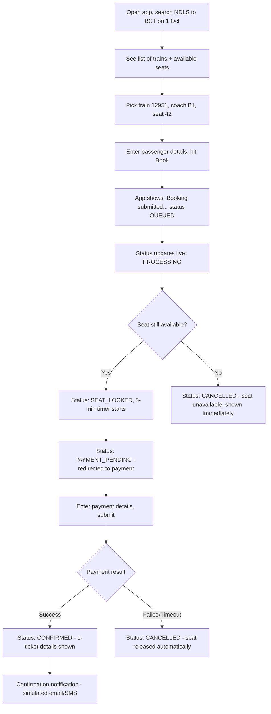
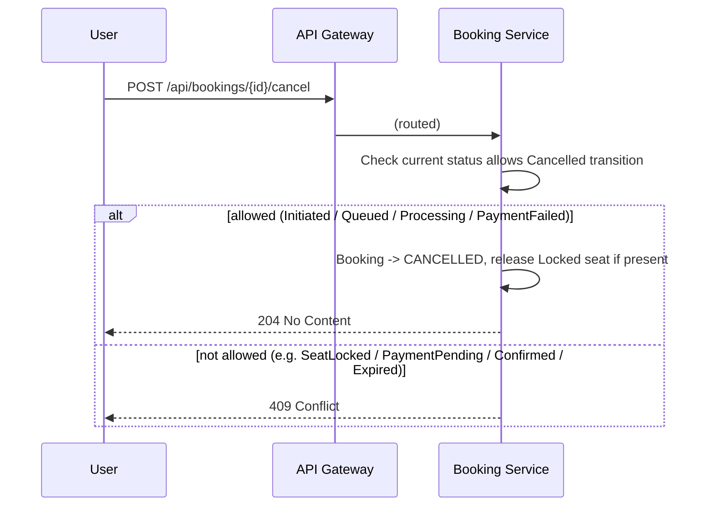

# Functional flow — the user's journey

Where `project-flow.md` explains the system, this explains what a PERSON
experiences, end to end, including the unhappy paths.

## Happy path: booking a Tatkal ticket

## What the user sees at each step, and why it takes that long

| User sees | Behind the scenes | Typical duration |
|---|---|---|
| "Searching trains..." | Search Service cache-aside lookup (L1/L2 Redis, falls to Postgres on miss) | <100ms cached, <500ms uncached |
| "Booking submitted, status: QUEUED" | `POST /api/bookings` returns 202 immediately — the booking hasn't actually touched seat inventory yet | Instant |
| "Status: PROCESSING" | `BookingCreatedConsumer` picked the message off the queue | Depends on queue depth — near-instant off-peak, seconds during a real Tatkal spike (this is the queue doing its job, not a bug) |
| "Status: SEAT_LOCKED" or "CANCELLED — seat unavailable" | Seat lock strategy resolved the race for this specific seat | Sub-second once dequeued |
| "Redirecting to payment..." | `PaymentRequested` event published, 5-minute countdown starts client-side (mirrors `SeatReservation.ExpiresAtUtc`) | Up to 5 minutes, user-paced |
| "Processing payment..." | Simulated gateway latency in `PaymentRequestedConsumer` | 50-300ms (simulated) |
| "CONFIRMED" / "CANCELLED — payment failed" | Saga compensation resolved | Sub-second after payment result |
| (later) confirmation notification | `NotifyUser` event → Notification Service | Async, best-effort |

## Unhappy paths a user can hit

**"I waited 4 minutes on the payment screen, then it said seat
unavailable."**
The 5-minute seat lock expired before payment completed.
`BookingExpirationSweeperService` released the seat and moved the booking
to `EXPIRED` — this is intentional (spec section 6/17): a seat can't stay
reserved indefinitely for someone who may have abandoned checkout, or the
next Tatkal spike would have every seat "held" by abandoned sessions
within seconds.

**"I clicked Book twice because the page felt frozen."**
Both clicks carry the same client-generated `Idempotency-Key` (assuming
the client correctly reuses it on retry). The second request returns the
SAME booking, not a second one — `IIdempotencyService`. If the client
generated a NEW key on the second click (a client bug), the user would
end up with two independent bookings; this repo's guarantee only covers
"the same logical request, retried," not "the user double-submitting."

**"My payment succeeded but the app still shows PROCESSING."**
Either a slow SignalR push (fallback: poll `GET /api/bookings/{id}`) or,
worst case, the client's WebSocket connection landed on a Booking Service
instance that didn't handle this particular event (see ADR-010's noted
SignalR-backplane gap). The booking's actual status in the database is
already correct in either case — this is a display-latency problem, not a
correctness problem.

**"I got charged but no booking shows up."**
Should not be possible by design: `PaymentRequested` is only ever
published after `SeatLocked`, and the outbox pattern guarantees that
event isn't lost even if Booking Service crashes right after locking the
seat (failure scenario 2/3). If this were reported in a real system,
the `BookingEvents` stream (`GET /api/bookings/{id}/events`) is the first
place to look — it shows every state transition with a timestamp,
independent of whatever the current `Bookings.Status` projection says.

## Cancellation flow (user-initiated)

A cancelled seat becomes bookable again immediately — the unique index
filter only covers `Locked`/`Confirmed` rows, so `Released` rows don't
block a new lock attempt.
